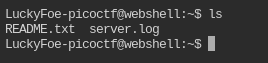
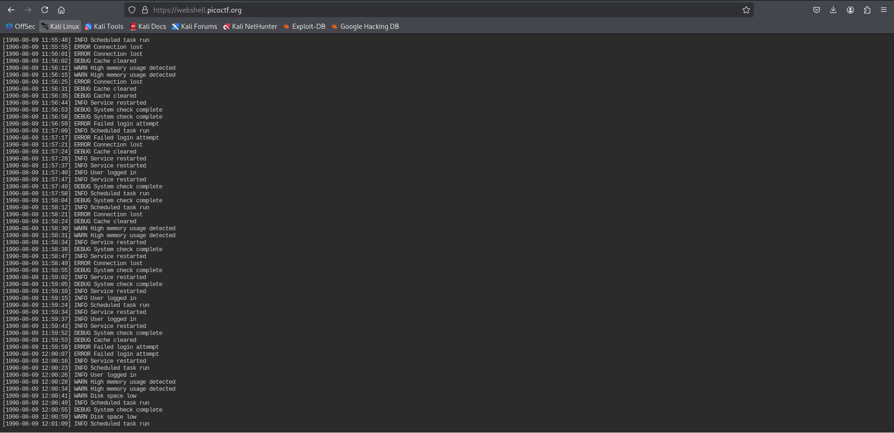
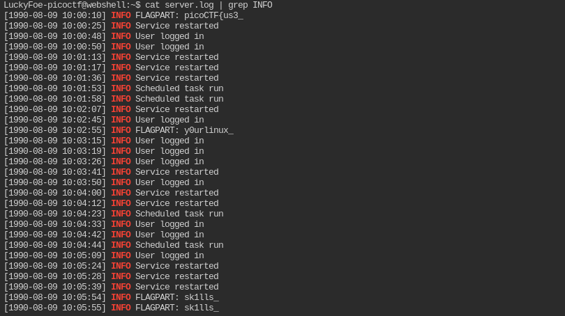
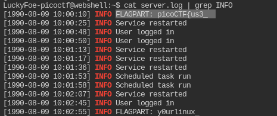
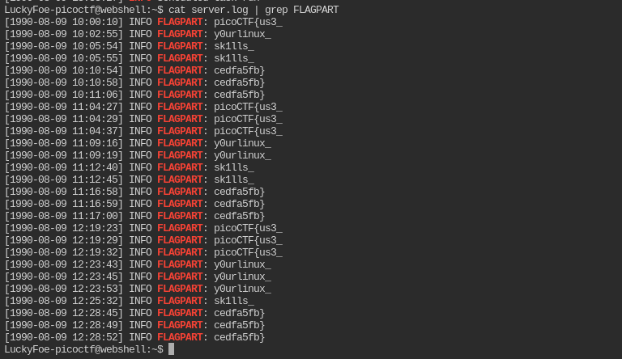

# Log Hunt (Writeup)

**Platform:** picoCTF  
**Challenge Author:** Yahaya Meddy  
**Category:** General Skills  
**Difficulty:** Easy  

---

## Summary  

I downloaded a server log for the **Log Hunt** challenge and discovered that pieces of the flag were being leaked in log lines labeled `FLAGPART:`. The fragments were scattered throughout the file and some parts repeated.  

I extracted the `FLAGPART` lines, cleaned and deduplicated them while preserving order, then joined the fragments to reconstruct the full flag.  

**Final flag I obtained:**  
```

picoCTF{us3_y0urlinux_sk1lls_cedfa5fb}

````

 

---

## What I Did Step-by-Step  

### Step 1: Download the log file  
I used `wget` inside the picoCTF webshell to download the challenge file:  
```bash
wget https://challenge-files.picoctf.net/c_saffron_estate/cbaf5310acc7fcfe879881106e90b1a3de92a961934567f7543bcd96c4aef977/server.log
````

 

---

### Step 2: Confirm the file is present

I listed files to confirm `server.log` was downloaded:

```bash
ls
```

 

---

### Step 3: Inspect the log

I viewed the file contents to understand its structure:

```bash
cat server.log
```




---

### Step 4: Search for relevant lines

I first searched for lines that contained the word **INFO** to see if I could get a clue:

```bash
cat server.log | grep INFO
```



I found a line with `FLAGPART` that seemed to hint at the flag content.



Then I searched directly for the lines that contained the word **FLAGPART**:

```bash
cat server.log | grep FLAGPART
```



---

### Step 5: Reconstruct the flag

I manually read the fragments and assembled them in order to get the original flag:

```
picoCTF{us3_y0urlinux_sk1lls_cedfa5fb}
```

And completed the CTF:


---

## Conclusion and Summary

Doing this CTF was a fun and simple way to practice using Linux commands to search through logs. At first, the log file looked confusing, but by filtering out specific lines using `grep`, I was able to spot the hidden flag parts. I learned how useful `grep` can be when analyzing large files or logs, especially for finding keywords quickly.

Overall, this challenge helped me strengthen my command-line skills and understand how to analyze log files efficiently. It was satisfying to piece together the scattered flag and see how each step led to the final answer.


